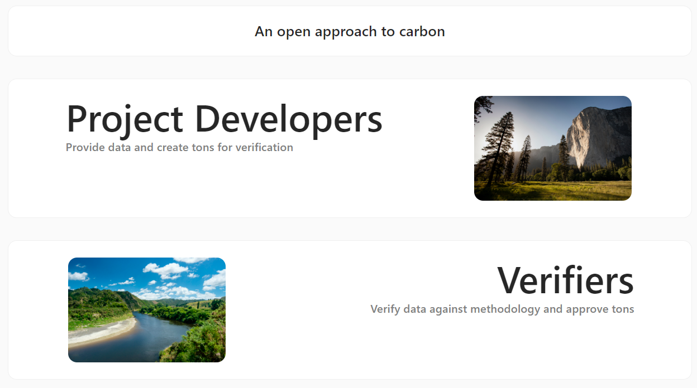

# 🏗 Verifier Demo App

An app allowing a project developer to make 'ton claims', a verifier to approve them and the public to check the tons for themselves.



Smart contracts can be found in 
```bash
'/packages/hardhat/contracts'
```

# 🏄‍♂️ Quick Start

### Manual setup

Prerequisites: [Node](https://nodejs.org/en/download/) plus [Yarn](https://classic.yarnpkg.com/en/docs/install/) and [Git](https://git-scm.com/downloads)

> clone/fork 🏗 scaffold-eth:

```bash
git clone https://github.com/Euan-Creol/scaffold-eth.git
```

> install and start your 👷‍ Hardhat chain:

```bash
cd scaffold-eth
yarn install
yarn chain
```

> in a second terminal window, start your 📱 frontend:

```bash
cd scaffold-eth
yarn start
```

> in a third terminal window, 🛰 deploy your contract:

```bash
cd scaffold-eth
yarn deploy
```

🌍 You need an RPC key for production deployments/Apps, create an [Alchemy](https://www.alchemy.com/) account and replace the value of `ALCHEMY_KEY = xxx` in `packages/react-app/src/constants.js`

📱 Open http://localhost:3000 to see the app
